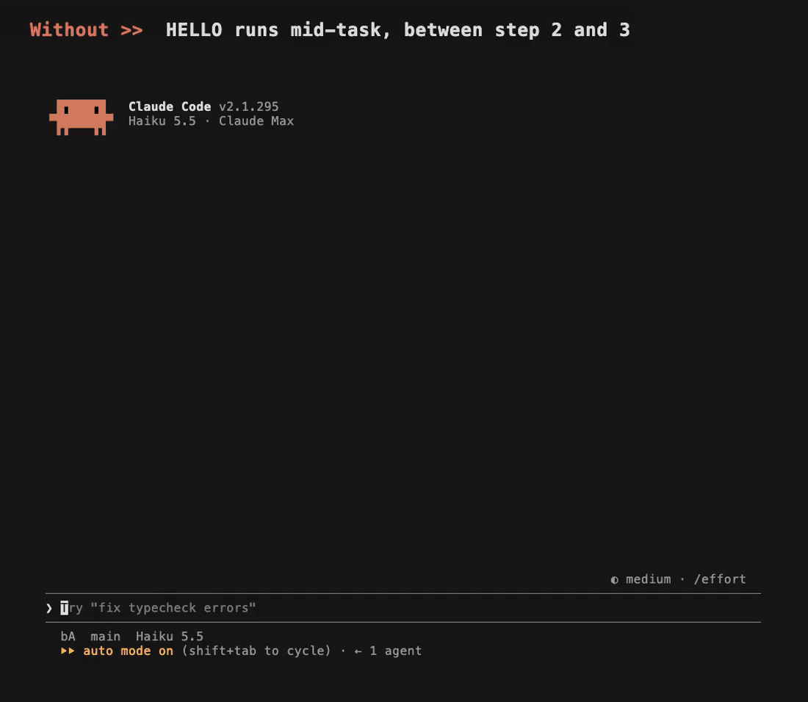

# prompt-queue

A Claude Code plugin for queuing prompts while Claude works. Start a line with `>>` and the prompt waits until Claude has completely finished its current turn. Then it is sent as a new prompt, starting a new turn.



## Why

By default, a prompt you send while Claude is working **steers the current turn**. Claude Code hands it to Claude at the next pause between tool calls, and Claude works it into the task in progress. That's what you want for a correction ("use the other file"). It's not what you want for "when you're done, do this next":

- the new request mixes into the current one, and Claude may switch to it halfway through
- you can't line up a few steps and walk away
- you end up watching for Claude to finish just to type the next thing

Claude Code's own queue shortcut (`ctrl+x enter`) is delivered the same way ([#99416](https://github.com/anthropics/claude-code/issues/99416)).

prompt-queue adds a real queue:

| While Claude is working, you send | What happens |
| --- | --- |
| `fix the typo too` | steers the current turn (Claude Code's default) |
| `>> fix the typo too` | waits until the turn has fully ended, then runs as a turn of its own |

When nothing is running and nothing is waiting, a `>>` prompt is sent right away like any other.

## Examples

**Queue the next task.** The prompt shows in a list above the prompt box until its turn comes:

```
>> run the tests and fix anything that fails
```

```
queued (1): >> edits · >>clear
  1. run the tests and fix anything that fails
```

**Line up several.** Each `>>` line is one prompt, and they run in order, each one after the previous turn ends. Lines without `>>` belong to the prompt above them:

```
>> fix the failing tests
   and keep the changes small
>> update the changelog
>> summarise what changed
```

**Steer now and queue the rest.** Text above the first `>>` line is sent straight away and steers the current turn. Only the `>>` lines wait:

```
also check the README while you're at it
>> then open a pull request
```

**Queue a command.** A queued `/command` runs as that command when its turn comes:

```
>> build the feature
>> /compact
>> write the docs for it
```

Two other forms work the same way:

- A command typed with `>>` lines below it runs now, and the lines wait for it to finish (`/compact`, then `>> carry on`).
- A queue survives `/clear`, so `>> /clear` followed by `>> start the next task` gives the next task a fresh conversation.

## Managing the queue

| Type | What it does |
| --- | --- |
| `>>` | Edit what's waiting. Every queued prompt comes back into the box, one `>>` line each. Change or delete lines and press Enter to save; Enter on its own keeps the queue as it was. Empty the box to remove them all. Prompts already sent are never in the edit. |
| `>>clear` | Drop everything that's waiting. |

**Pausing.** If you press Esc to interrupt Claude, or a turn fails, the queue pauses so nothing runs on its own. While it's paused, `>>` resumes it and `>>edit` opens the edit.

## Good to know

- A `>>` that will queue its line is shown in colour as you type. A `>>` anywhere else (mid-line, inside a ```` ``` ```` block, or stuck to a word like `>>this`) is ordinary text.
- `@file` mentions in a queued prompt reach Claude as plain text, without the file attached. Claude Code only attaches files to prompts you send yourself, though Claude can still open the file.
- Images can't wait in the queue. Send a prompt with an image without `>>`.
- A queued line can't start with a `/` that isn't a command, such as a path. Put a word first: `>> read /tmp/log.txt`.
- Claude Code shows "Prompt dropped by a hook" when prompt-queue takes a prompt into the queue. That's expected. Prompts sent later from the queue are labelled "Prompt from the prompt-queue plugin".
- `>>` isn't a slash command, so it doesn't get in the way of `/` commands such as `/q`.

## Install

You need Claude Code 2.1.295 or newer. prompt-queue is built on the Claude Code mod API, which is in early access and may change between releases.

```sh
claude plugin marketplace add romanlv/prompt-queue
claude plugin install prompt-queue@prompt-queue
```

Start a new session and type `>> hello`. With nothing running, it is sent at once.

Other ways to install:

```sh
# from a clone or fork on your machine
git clone https://github.com/romanlv/prompt-queue.git
claude plugin marketplace add ./prompt-queue
claude plugin install prompt-queue@prompt-queue

# for one session only, without installing
claude --plugin-dir ./prompt-queue
```

To update, turn off or remove it:

```sh
claude plugin marketplace update prompt-queue && claude plugin update prompt-queue@prompt-queue
claude plugin disable prompt-queue@prompt-queue     # keep it installed, but off
claude plugin uninstall prompt-queue@prompt-queue && claude plugin marketplace remove prompt-queue
```

Changes take effect in the next session you start.

## Develop

From the repository folder:

```sh
claude --plugin-dir .      # start Claude Code with this copy loaded
claude plugin validate .
claude plugin test .
```
